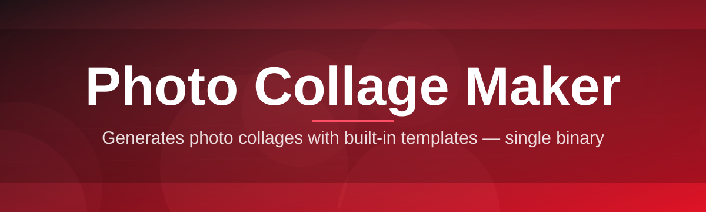
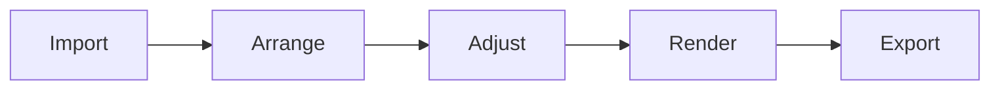

# collage-editor 🖼️✨

  

*One canvas, endless layouts — turn a folder of photos into a collage in minutes, not hours.*

## 🧩 Overview

**collage-editor** is a native Windows photo collage maker built by a solo dev who got tired of clunky, ad-riddled collage tools that take forever to open a single window. It's a desktop app, not a browser tab pretending to be one — you open it, you drag photos in, you export. No accounts, no cloud uploads, no "watermark unless you upgrade" nonsense. Just a fast, focused canvas for arranging pictures into something worth printing or posting.

The tool sits at the intersection of a photo editor and a layout designer. You get grid-based templates for the "I just want a nice 3x3 for Instagram" crowd, alongside a fully freeform canvas for people building wedding albums, moodboards, yearbook pages, or gallery walls. Under the hood it's optimized for large batches of high-resolution images, so whether you're collaging a dozen vacation shots or a few hundred event photos, the canvas stays responsive.

Who is this for? Photographers exporting client galleries, students slapping together a project board the night before it's due, small businesses making product collages for listings, and anyone who just wants to combine photos without opening three different apps to do it. If you've ever thought "there has to be a simpler way to do this," this is that simpler way.

  

> [!TIP]
> New here? Skip straight to the **How to Get Started** section below — three clicks and you're arranging photos.

---

## 🚀 What It Actually Does

- **Grid & freeform layouts** — snap into a clean template grid, or break free and drag, rotate, and layer photos anywhere on the canvas like a digital corkboard.

- **Batch photo import** — drop an entire folder of images at once and the collage editor auto-populates the nearest empty slots, so you're not dragging photos one by one.

- **Smart auto-fit cropping** — photos resize and crop intelligently to fill each frame without stretching faces into funhouse-mirror territory.

- **Border, spacing & background controls** — dial in gutter width, canvas color, and frame borders down to the pixel, or let a preset handle it in one click.

- **Text & sticker overlays** — drop captions, dates, or simple shapes onto the collage for invitations, flyers, and social posts.

- **Multi-page & poster export** — build collages that span multiple export tiles for large-format prints, not just single-image shares.

- **Non-destructive editing** — every adjustment lives in a project file you can reopen and tweak later; your original photos are never touched or overwritten.

- **High-res export presets** — one-click export tuned for Instagram squares, A4/A3 print sheets, desktop wallpapers, or custom pixel dimensions.

> [!NOTE]
> All processing happens locally on your machine. Nothing gets uploaded anywhere — your photos never leave your PC.

---

<strong>📥 How to Get Started</strong>

 

Getting from "zero" to "finished collage" takes about four steps:

1. **Visit the landing page** — hit the Download button anywhere on this page to reach the official collage-editor site.

2. **Download the installer** — grab the latest Windows build. It's a single package, no bundled toolbars, no surprise extras.

3. **Run it** — launch the installer, follow the two or three prompts, and let it drop a shortcut on your desktop.

4. **Open collage-editor and start dragging photos in** — pick a template, import your images, and start arranging. Export when it looks right.

> [!IMPORTANT]
> No admin rights? No problem — collage-editor installs to your user profile by default, so it works fine on locked-down work or school laptops.

<strong>💻 System Requirements</strong>

 

| Requirement | Minimum |
|---|---|
| OS | Windows 10 (64-bit) or Windows 11 |
| RAM | 4 GB (8 GB recommended for large batches) |
| Storage | 250 MB free disk space |
| Dependencies | None — fully standalone, no runtime installs required |
| GPU | Not required, but improves canvas rendering on large collages |

  

---

## ⚙️ How It Works

The collage-editor pipeline is intentionally simple — four steps between "pile of photos" and "finished collage":

1. **Import** — photos are loaded and thumbnailed for fast browsing, regardless of original resolution.

2. **Arrange** — you place photos into a template grid or freeform canvas; the layout engine tracks position, rotation, and z-order.

3. **Adjust** — crop, border, spacing, and overlay settings are applied per-frame, non-destructively.

4. **Render & Export** — the canvas is flattened at your chosen resolution and written out as a final image file.

> [!TIP]
> Save your layout as a project file before exporting — you can reopen it later and swap in new photos without rebuilding the whole collage from scratch.

---

<strong>🛠️ Troubleshooting</strong>

 

**Q: My exported collage looks blurry even though the source photos are sharp.**
A: Check your export resolution preset — if you picked a social-media size but your canvas was built at print resolution, the downscale can look soft. Match the export preset to your intended use.

**Q: A photo is cropped in a way that cuts off someone's head.**
A: Auto-fit cropping centers on the frame by default. Double-click the photo inside its frame to reposition the crop focus manually.

**Q: The app won't import my HEIC photos from my phone.**
A: Convert HEIC photos to JPEG/PNG first — HEIC support depends on Windows codecs and isn't guaranteed on every system.

**Q: My collage looks fine on screen but prints with a white border I didn't add.**
A: Your printer driver may be adding its own margin. Export at your exact target print size and disable "fit to page" in the print dialog.

**Q: Text overlays look pixelated after export.**
A: Text is rendered at canvas resolution — increase your canvas size before adding large text, rather than scaling text up on a small canvas.

**Q: The app feels slow with 100+ photos loaded.**
A: Large batches are memory-hungry. Close other heavy apps, or split the project into two collages and merge the exports.

<strong>🎨 UI, UX & Keyboard Shortcuts</strong>

 

collage-editor ships with a **dark theme by default** because most photo work happens at odd hours, plus a light theme for daytime editing — toggle it from Settings.

| Action | Shortcut |
|---|---|
| New project | `Ctrl + N` |
| Import photos | `Ctrl + I` |
| Save project | `Ctrl + S` |
| Export collage | `Ctrl + E` |
| Undo / Redo | `Ctrl + Z` / `Ctrl + Y` |
| Delete selected frame | `Delete` |
| Duplicate frame | `Ctrl + D` |
| Zoom canvas | `Ctrl + Scroll` |
| Toggle grid snap | `G` |

> [!WARNING]
> Undo history clears when you close a project. Save before switching to a different collage if you want to keep the ability to roll back changes.

Settings persist locally per project profile, so your preferred canvas size, spacing defaults, and theme carry over the next time you open the app.

---

## 🤝 Contributing & Community

collage-editor is built in the open and stays that way. Bug reports, feature requests, and pull requests are genuinely welcome — this isn't a corporate roadmap, it's a living tool shaped by the people who actually use it.

- Found a bug? Open an issue with steps to reproduce and, ideally, a screenshot of the collage in question.

- Got an idea for a layout template or export preset? Suggestions that solve a real editing pain get prioritized.

- Want to contribute code? Fork, branch, and submit a pull request — small, focused changes get reviewed fastest.

> [!NOTE]
> This project ships fast and stays lean on purpose. Expect frequent small updates rather than rare, massive ones.

---

## 📄 License

Released under the [MIT License](LICENSE), 2026. Use it, modify it, ship it in your own workflow — just keep the license notice intact.

---

## ⚠️ Disclaimer

collage-editor is provided as-is, without warranty of any kind. It's built and maintained by a solo developer with genuine care but no formal SLA — always keep backups of your original photos, and verify exported collages before printing or publishing them. The maintainer is not responsible for print shop bills, missed deadlines, or collages that turned out slightly too artsy.

  

